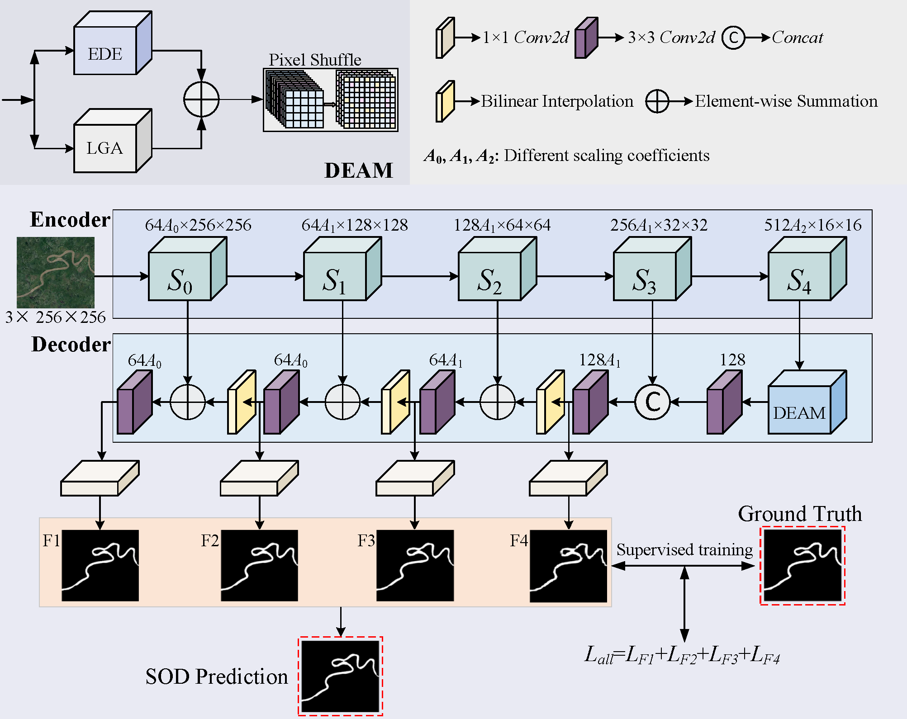

# SOLNet

This repository contains the PyTorch implementation of the paper "Speed-oriented Lightweight Salient Object Detection in Optical Remote Sensing Images" published in TGRS. The code provided here is designed to reproduce the experimental results and figures presented in the paper.  
  

# Requirements

    python==3.7.12
    pytorch==1.11.0
    torchvision==0.12.0
    torchaudio==0.11.0
    cudatoolkit=11.3
    tensorboard==1.15.0
    tqdm==4.66.1
    thop
    imageio
    numpy
    pyyaml

# Customizing Training Configuration

You have the flexibility to tailor the training process to your specific needs by modifying the configuration parameters in the `SOLNet.yaml` file located within the `config` directory. This allows you to adjust settings such as learning rates, batch sizes, and other hyperparameters to optimize training for your dataset and hardware setup.

## Running the Training Script

Make sure your data is organized correctly, as this will impact the training process.

、python train.py、

## Analyzing Training Results with TensorBoard

After the training process is completed, you can analyze the model's performance by examining the curves in TensorBoard. This visual representation of the training metrics will help you determine the optimal weights for your model.

1. **Launch TensorBoard**:
   Run the following command to launch TensorBoard and visualize the training metrics:  
、、、
    tensorboard --logdir=[path_to_your_logs]
    
Replace [path_to_your_logs] with the actual path to the directory containing your TensorBoard logs.

3. **Identify Optimal Weights**:
   Once TensorBoard is open, navigate to the sections displaying the training loss, accuracy, or other relevant metrics. Use these curves to identify the epoch or checkpoint that corresponds to the best performance of your model.

4. **Run the Model Conversion Script**:
Use the provided model conversion script to convert the identified optimal weights. Execute the following command:  
、、、
    cd ./model
    python Model_Convert.py

Before proceeding with the model conversion, it is essential to verify that the `SOLNet.yaml` file located in the `config` directory contains the correct paths for both checkpoint storage and model conversion. Incorrect paths may lead to failures in converting the model. Please ensure that the following sections in `SOLNet.yaml` are correctly configured:

- `checkpoint_path`: The directory where model checkpoints are saved.
- `model_convert`: The path where the converted model will be stored.
  
## Running the Training Script

# Results

Our prediction results on EORSSD and ORSSD datasets are available for download from [Google Cloud Drive](https://drive.google.com/file/d/1L5-YBXdrrurq2TN495ecy4JuK7Hxoq-p/view?usp=sharing).
